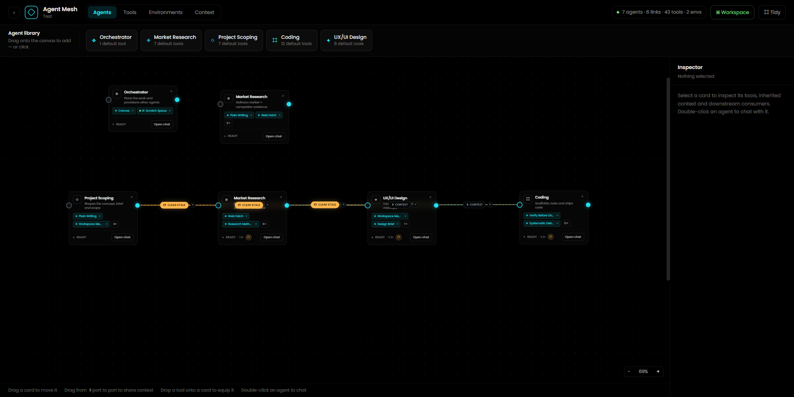
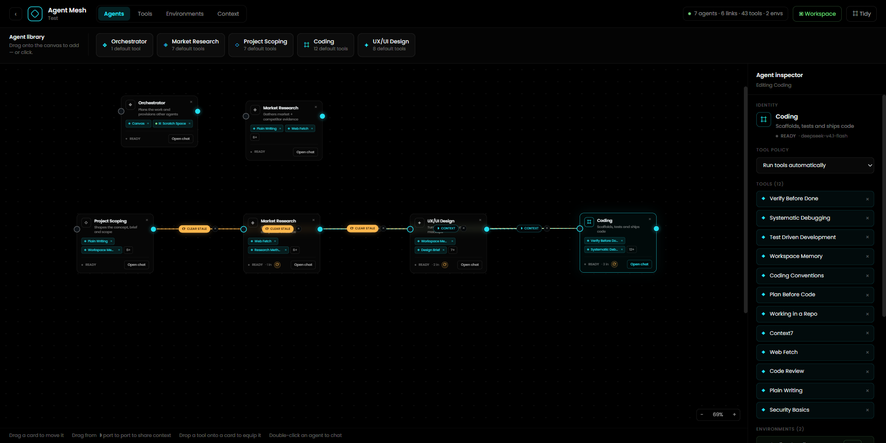
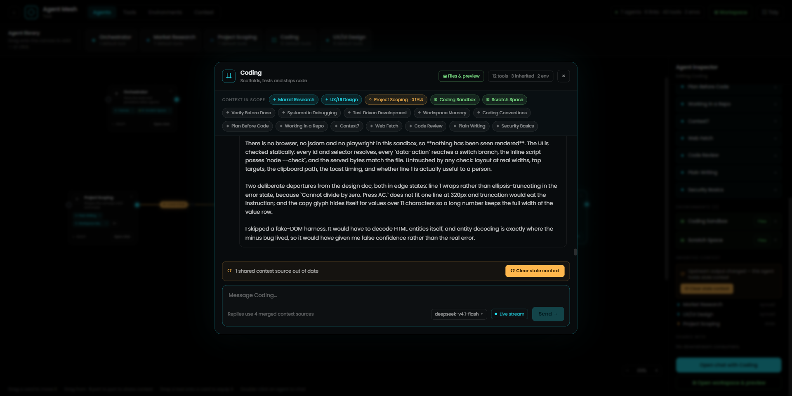
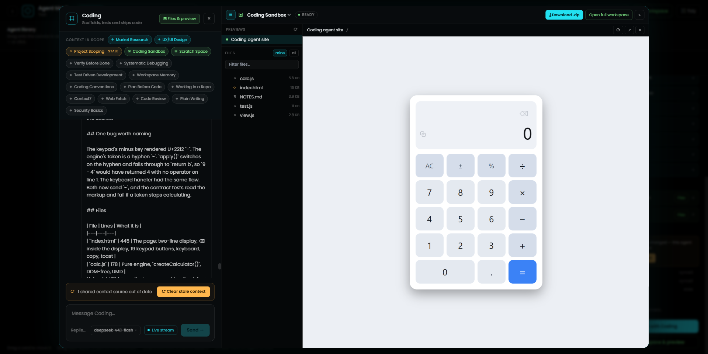
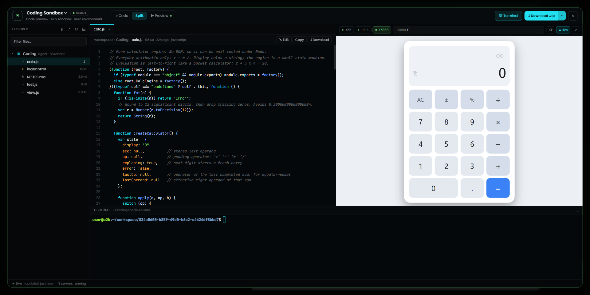
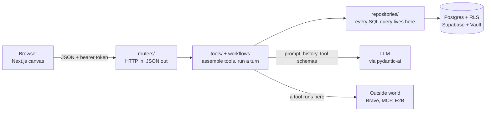

# Agent Mesh

**Telstra Muru-D, Team 2.** An idea-to-product pipeline where you build your team of AI agents on a canvas, draw arrows between them, and watch a vague idea turn into research, a scoped brief, a design, and running code in a sandbox you can open in your browser.



Most agent tools give you one chat box. This one gives you a whiteboard. Every card is an agent with its own job, its own tools and its own memory. Every arrow says "this agent should know what that one learned." You can talk to any of them directly, or hand the whole thing to the Orchestrator and let it staff the board for you.

---

## A five-minute tour

If you only read one section, read this one. It walks through what you actually see, in the order you'll see it.

### 1. The canvas

After logging in you pick a project, and each project is its own canvas. Along the top is the **agent library**: Orchestrator, Market Research, Project Scoping, Coding and UX/UI Design. Drag one onto the board (or just click it) and it spins up with a sensible set of default tools already attached.

The little cyan dots on either side of a card are **ports**. Drag from the right-hand port of one card to the left-hand port of another and you've made a context arrow. That's the whole wiring model.

### 2. The inspector



Click a card and the right-hand panel shows what that agent is made of. Three things are worth knowing about here:

- **Tool policy.** "Run tools automatically" lets the agent act on its own. Switch it to "Ask before every tool call" and each one pauses and waits for you to approve or deny it.
- **Tools.** Skills (instruction packs like *Test Driven Development* or *Plain Writing*), web tools (Brave Search, Web Fetch), and MCP connections (GitHub, Gmail, Context7, or any MCP server URL you give it). Drag a tool onto a card to equip it.
- **Environments.** An E2B cloud sandbox the agent can read, write and run code in.

### 3. The chat



Double-click an agent, or hit **Open chat**. The strip of chips at the top is everything this agent can "see" right now: which other agents feed it context, which sandboxes it has, which tools it holds.

See the orange **STALE** chip on Project Scoping? That means Project Scoping has said more since its summary was last taken. The agent still uses the old summary (an old summary beats none), but you get a button to refresh it. Nothing re-summarises behind your back, because a chatty agent quietly running up model costs on every neighbour is not a fun surprise.

Replies stream live. You can stop a turn mid-answer, close the tab, come back later, and the turn is still there, because it runs on the server independently of your browser.

### 4. The workspace



When an agent has a sandbox, **Files & preview** opens a side panel. Files the agent writes show up as it writes them. If it built something with an HTML page, you get a live preview right there. In this shot the Coding agent was asked to "build me a calculator," and that's the running result.



**Open full workspace** gives you the full IDE-ish view: file explorer, code viewer, preview pane on whatever port the agent is serving, a real terminal into the sandbox, and a **Download .zip** button when you want to take the code home.

---

## How it works, without the jargon

Here's the mental model. Hold on to these three ideas and the rest of the codebase will make sense.

**Boxes are rows.** Every card on the canvas is one row in a `nodes` table. Every arrow is one row in `edges`. The canvas is just a picture of the database.

**Arrows are pulled, not pushed.** Drawing an arrow doesn't send anything anywhere. When an agent starts a turn, it asks "what points at me?" and reads the summaries stored on those arrows. Nothing is copied between conversations.

**The model only sees function names.** When an agent gets a tool, the model is handed a name, a description and typed arguments. It never sees a URL, an API key or a node id. Secrets live in Supabase Vault and only get decrypted by the backend, in memory, for the one call that needs them.



Each layer only talks to its neighbour. A router never touches the database, and a repository has no idea HTTP exists. The model and the outside world never get a database connection.

### A few design choices that might surprise you

- **You can't read your own API keys back.** You can set a tool's key, but only the backend's service role can decrypt it. A database dump yields nothing useful.
- **There is no 403.** Anything you don't own returns 404, so the API never confirms that someone else's project exists. Row Level Security in Postgres does the filtering, and the repositories filter again by owner as a second lock.
- **A broken tool doesn't break the conversation.** If a tool fails to build, the agent is told that capability is unavailable and carries on. If a tool fails mid-call, the error is handed to the model as text so it can try something else.
- **Approvals survive a restart.** When a tool call is waiting for your approval, the half-finished run is serialised into Postgres. You can redeploy the backend, click Approve ten minutes later, and the run picks up where it stopped.

For the long version with diagrams, open [docs/SYSTEM_GUIDE.html](docs/SYSTEM_GUIDE.html) in a browser.

---

## Check your understanding

A quick self-test. Have a guess, then click to reveal. If you get all five, you understand this system better than most people who've only read the code.

<details>
<summary><b>1.</b> You draw an arrow from Market Research to Project Scoping. What gets sent to Project Scoping at that moment?</summary>

<br>

**Nothing.** Arrows are pulled, not pushed. The next time Project Scoping takes a turn, it looks up every arrow pointing at it and reads the summary stored on each one. The summary is passed as per-turn instructions, not stitched into its own transcript.

</details>

<details>
<summary><b>2.</b> Market Research keeps chatting after the summary was taken. Does Project Scoping get the new stuff automatically?</summary>

<br>

**No.** The arrow goes **stale** (the orange chip). Staleness is calculated, not stored: the backend compares the message number the summary was taken at against the source conversation's latest one. The old summary is still used until someone hits refresh. That's deliberate, so model costs never climb silently.

</details>

<details>
<summary><b>3.</b> An agent is set to "Ask before every tool call". It requests a web search, then the backend redeploys before you click Approve. What happens?</summary>

<br>

**The search still runs when you approve.** The paused run, including the model's pending tool call, was saved to Postgres before the first request even returned. Resume rebuilds the tools and carries on. (Pauses older than an hour are cleared, and you'll get a 409.)

</details>

<details>
<summary><b>4.</b> You try to open a project id that belongs to another user. What status code do you get?</summary>

<br>

**404, not 403.** A 403 would confirm the project exists. Postgres Row Level Security simply returns no rows, and the router reports "not found".

</details>

<details>
<summary><b>5.</b> Your Brave Search API key is wrong. When do you find out?</summary>

<br>

**When you save the tool config, not halfway through a conversation.** Each tool kind has a cheap `build()` that runs every turn and a `verify()` that is allowed to hit the network. Verify runs on save, so a bad key shows up as a red card straight away.

</details>

---

## Running it locally

You'll need Python 3.12+, Node 20+, and accounts for Supabase and E2B. For the LLM, the default provider is Ollama's hosted API; Gemini also works.

**1. Backend**

```bash
cd backend
python -m venv .venv
source .venv/bin/activate        # Windows: .venv\Scripts\activate
pip install -r requirements.txt
cp .env.example .env             # then fill it in, see below
```

**2. Database.** Point `DBOS_DATABASE_URL` at your Supabase Postgres, then apply the migrations. The dry run applies everything and rolls it back, so you can check first.

```bash
python migrations/apply.py --dry-run
python migrations/apply.py
```

**3. Frontend**

```bash
cd frontend
npm install
cp .env.example .env.local       # NEXT_PUBLIC_API_URL=http://localhost:8000
```

**4. Run both** from the repo root:

```bash
npm install
npm run dev
```

Open http://localhost:3000. Keep the frontend on port 3000: it's the redirect URL Supabase auth is set up to allow.

### Environment variables

The ones you'll actually need to fill in:

| Variable | What it's for |
|---|---|
| `SUPABASE_URL`, `SUPABASE_KEY` | Your Supabase project and its publishable key |
| `SUPABASE_SERVICE_KEY` | Decrypting tool secrets from Vault. Backend only, never the frontend |
| `DBOS_DATABASE_URL` | Postgres connection for migrations and durable runs |
| `LLM_PROVIDER`, `OLLAMA_API_KEY` | The default model provider (`ollama`) |
| `GEMINI_API_KEY` | If you switch the provider to Gemini |
| `E2B_API_KEY` | Sandboxes for the Coding agent and friends |
| `BRAVE_API_KEY` | Web search tool |
| `GOOGLE_OAUTH_CLIENT_ID`, `GOOGLE_OAUTH_CLIENT_SECRET`, `OAUTH_STATE_SECRET` | Google sign-in and the Gmail tool connect flow |

The full list, with defaults, lives in [backend/app/config.py](backend/app/config.py). Everything boots without an LLM key: only chat fails, `/health` stays green.

Interactive API docs are at http://localhost:8000/docs once the backend is running.

---

## Where things live

```
backend/
  app/
    routers/        HTTP endpoints: auth, projects, chat, environments, oauth
    services/       agent construction, turn runner, Supabase clients
    tools/          skills, API tools (Brave, Web Fetch), MCP, the canvas tool
    environments/   E2B sandbox lifecycle, file access, previews
    repositories/   every database query
  migrations/       plain SQL, applied in order by apply.py
frontend/
  src/components/   canvas, node cards, chat window, inspector
  src/components/workspace/   file tree, code view, preview, terminal
  src/lib/api.ts    one function per backend endpoint
docs/
  API.md            the full HTTP API
  SYSTEM_GUIDE.html the deep dive, with diagrams
```

## Built with

FastAPI and [Pydantic AI](https://ai.pydantic.dev/) on the backend, Next.js 16 and React 19 on the front, Supabase for auth, Postgres and secret storage, E2B for sandboxes, and DBOS for durable turns. Deployed on Railway. CI runs ruff, pytest, bandit and pip-audit on every push.
