<p align="center">
  
</p>

<p align="center">
  
  
  
  
  
  
  
</p>

<p align="center">
  <b>You bring the idea. A team of AI agents does the research, writes the brief, sketches the design and builds the thing.</b><br>
  <sub>And you watch it all happen on one canvas.</sub>
</p>

---

## What is this?

Most AI tools give you a single chat box. Agent Mesh gives you a whiteboard instead.

Each card on the board is an AI agent with one job. One researches the market, one turns that into a project brief, one designs the screens, one writes the code. You connect them with arrows, and an arrow simply means *"you should know what that agent found out."*

You can chat with any agent on its own. You can also hand the whole idea to the **Orchestrator**, and it will add the agents it thinks you need, wire them up and get them going.

When the Coding agent builds something, it builds it for real, inside a cloud sandbox. You can open its files, watch a live preview, use a terminal, and download the whole thing as a zip.

## A quick look around

### The canvas


Each project gets its own canvas. The ready-made agents sit along the top: drag one onto the board and it arrives with a sensible set of tools already attached. To connect two agents, drag from the dot on the right of one card to the dot on the left of another.

### The inspector


Click a card to see what it's made of. You'll find its **tools** (web search, page fetching, GitHub, Gmail, and "skills" like *Test Driven Development* or *Plain Writing*), its **sandboxes**, and its **tool policy**. Set the policy to *Ask before every tool call* if you'd like to approve each action yourself.

### The chat


Double-click an agent to talk to it. The chips along the top show everything the agent can see right now: the agents feeding it, its sandboxes and its tools. Replies stream in as they're written, and you can stop one halfway through.

An orange **STALE** chip means one of the agents feeding this one has said more since it was last summarised. You decide when to refresh it.

### Files and live preview


Once an agent has a sandbox, **Files & preview** opens right next to the chat. Files appear as the agent writes them, and anything with a web page shows up as a live preview. That calculator? We asked the Coding agent to *"build me a calculator"*.

### The full workspace


**Open full workspace** gives you a proper editor view: file explorer, code, live preview, and a real terminal inside the sandbox. Hit **Download .zip** when you want to take the project with you.

---

## How it works

### Arrows share what an agent knows



Drawing an arrow doesn't copy anything straight away. The arrow keeps a short **summary** of the source agent's conversation. Whenever the agent on the other end replies, it reads that summary first, so it answers as if it had been in the room.

If the source agent keeps talking, the summary falls behind and the arrow turns orange. It never refreshes on its own, because that would quietly spend money on every message. You click refresh when you want the new version.

### What happens when you hit Send



The agent reads what its arrows tell it and then starts answering. Partway through it might decide it needs a tool: a web search, a page fetch, a file in its sandbox. The tool runs, the result goes back to the agent, and it keeps writing. This can happen several times in one reply.

If you've set an agent to *ask first*, it stops at the tool and waits for your OK. That wait is saved in the database, not in memory, so you can approve it minutes later, even after the server has restarted, and it picks up exactly where it left off.

### A few things you get for free

- **Your keys stay secret.** API keys go into Supabase Vault, encrypted. The agent never sees them, you can't read them back, and a database dump doesn't reveal them.
- **You only see your own stuff.** Postgres itself filters every row by owner. Someone else's project doesn't return "forbidden", it returns "not found", as if it doesn't exist.
- **One broken tool doesn't break the chat.** If a tool is misconfigured, the agent is told it's unavailable and carries on without it. If a tool fails mid-call, the agent sees the error and can try something else.
- **Bad keys show up early.** Tools are checked when you save them, so a typo'd API key turns the card red right away instead of failing halfway through a conversation.

For the deep dive with every diagram, open [docs/SYSTEM_GUIDE.html](docs/SYSTEM_GUIDE.html) in a browser. The full HTTP API is in [docs/API.md](docs/API.md).

---

## Run it yourself

You'll need **Python 3.12+**, **Node 20+**, a **Supabase** project and an **E2B** account. The LLM runs through Ollama's hosted API by default, and Gemini works too.

**1. Backend**

```bash
cd backend
python -m venv .venv
source .venv/bin/activate        # Windows: .venv\Scripts\activate
pip install -r requirements.txt
cp .env.example .env             # fill in your keys (table below)
```

**2. Database.** Set `DBOS_DATABASE_URL` to your Supabase Postgres, then apply the migrations. `--dry-run` applies everything, shows you the result and rolls it back.

```bash
python migrations/apply.py --dry-run
python migrations/apply.py
```

**3. Frontend**

```bash
cd frontend
npm install
cp .env.example .env.local       # NEXT_PUBLIC_API_URL=http://localhost:8000
```

**4. Start both** from the repo root:

```bash
npm install
npm run dev
```

Then open **http://localhost:3000**. Keep it on port 3000, because that's the address Supabase sign-in redirects back to.

### Keys you'll need

| Variable | What it's for |
|---|---|
| `SUPABASE_URL`, `SUPABASE_KEY` | Your Supabase project and its publishable key |
| `SUPABASE_SERVICE_KEY` | Unlocks tool secrets from Vault. Backend only, never the frontend |
| `DBOS_DATABASE_URL` | Postgres connection for migrations and saved runs |
| `LLM_PROVIDER`, `OLLAMA_API_KEY` | The model provider (default `ollama`) |
| `GEMINI_API_KEY` | Only if you switch the provider to Gemini |
| `E2B_API_KEY` | Cloud sandboxes for the agents |
| `BRAVE_API_KEY` | Web search |
| `GOOGLE_OAUTH_CLIENT_ID`, `GOOGLE_OAUTH_CLIENT_SECRET`, `OAUTH_STATE_SECRET` | Google sign-in and connecting Gmail |

Every setting and its default lives in [backend/app/config.py](backend/app/config.py). The server starts fine without a model key: only chat fails, and `/health` stays green. The interactive API docs are at http://localhost:8000/docs.

---

## Where things live

```
backend/app/
  routers/        the HTTP endpoints: auth, projects, chat, environments, oauth
  services/       builds agents and runs each turn
  tools/          skills, web tools, MCP connections, and the Orchestrator's canvas tool
  environments/   E2B sandboxes: files, terminal, previews
  repositories/   every database query, and nothing else
backend/migrations/   plain SQL, applied in order by apply.py
frontend/src/
  components/             canvas, cards, chat, inspector
  components/workspace/   file tree, code view, preview, terminal
  lib/api.ts              one function per backend endpoint
```

---

<p align="center">
  <sub>Built by Team 2 for the Telstra Muru-D program. CI runs ruff, pytest, bandit and pip-audit on every push.</sub>
</p>
